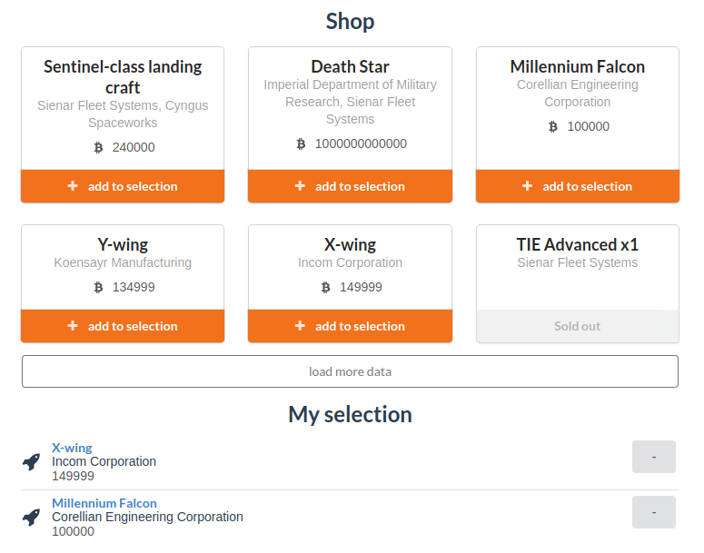

# swapi-shop-vue-vuex

[](https://travis-ci.org/maxpou/sw-shop-vuejs) [](https://standardjs.com)



> A Vue.js + Vuex project using the [Star Wars API](https://swapi.co/).

[A demo is available HERE](http://www.maxpou.fr/sw-shop-vuejs/)

## What's inside

* [VueJs 2](https://vuejs.org/): an awesome JS Framework ❤️
  * [vuex](https://vuex.vuejs.org/en/): A state management library for VueJs
  * [Axios](https://github.com/mzabriskie/axios): a well known library for XMLHttpRequests
  * Unit Tests (run in PhantomJS with Karma + Mocha + karma-webpack)
  * End-to-end tests (with Nightwatch)
* [SemanticUI](http://semantic-ui.com/): CSS Framework.


## Build Setup

``` bash
# install dependencies
npm install

# serve with hot reload at localhost:8080
npm run dev

# build for production with minification
npm run build

# build for production and view the bundle analyzer report
npm run build --report

# run unit tests
npm run unit

# run e2e tests
npm run e2e

# run all tests
npm test
```

For detailed explanation on how things work, checkout the [guide](http://vuejs-templates.github.io/webpack/) and [docs for vue-loader](http://vuejs.github.io/vue-loader).
